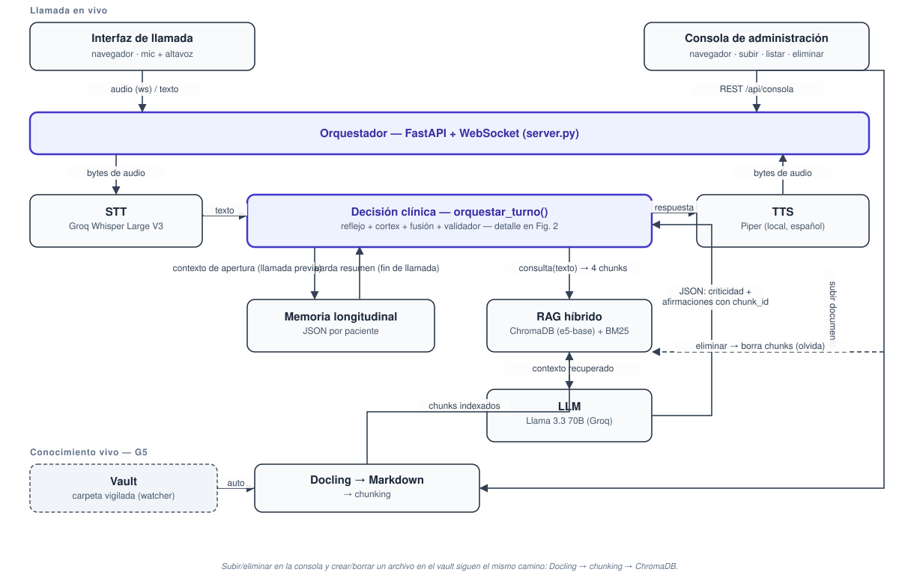
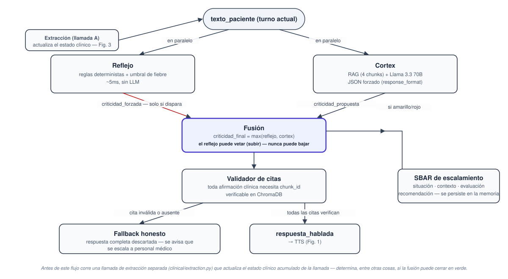

# Informe final — Agente de voz postoperatorio

Tech Sphere Challenge 2026 · Entregable 03

> Este informe se redactó durante la construcción, con Claude Code como asistente de
> desarrollo. Todo lo que declara este documento se contrasta contra el código y los logs
> del repositorio — donde hay una limitación conocida, se nombra explícitamente en vez de
> maquillarla, siguiendo el mismo principio de honestidad que se le exige al agente.

---

## 1. El problema y el objetivo

El seguimiento postoperatorio depende hoy de personal humano llamando uno a uno a cada
paciente en las primeras horas y días tras el procedimiento. Es costoso, no escala, y
queda sujeto al criterio y disponibilidad de quien hace la llamada. El paciente, mientras
tanto, describe lo que siente en lenguaje cotidiano, ambiguo y regional — no en términos
clínicos — y el conocimiento contra el que hay que contrastar esos síntomas (protocolos,
guías de recuperación, instructivos por procedimiento) cambia de versión constantemente.

El objetivo de esta solución es un agente de voz que:

1. Conversa con el paciente en español, adaptándose a lo que responde.
2. Fundamenta cada afirmación clínica en un corpus de conocimiento verificable (RAG), y
   se abstiene explícitamente cuando no tiene una fuente que respalde lo que iba a decir.
3. Compara lo reportado contra la trayectoria de recuperación esperada para ese
   procedimiento y ese día postoperatorio — un dolor de 4/10 no significa lo mismo en el
   día 1 que en el día 14.
4. Decide cuándo escalar a personal humano, con una vía de decisión determinista que
   nunca puede ser silenciada por el LLM.
5. Deja un registro estructurado de cada llamada.

## 2. Arquitectura

**Diagrama de arquitectura**: [`diagrama-arquitectura.svg`](diagrama-arquitectura.svg)
**Diagrama de flujo de decisión**: [`diagrama-flujo-decision.svg`](diagrama-flujo-decision.svg)



La solución expone las dos superficies exigidas por el reto sobre un único servidor
FastAPI + WebSocket (`orchestrator/server.py`): la **interfaz de llamada** (mic/altavoz en
el navegador, streaming bidireccional de audio) y la **consola de administración**
(subir/listar/eliminar documentos del corpus, más un inspector de qué respondería el RAG a
una consulta dada).

Cada turno de voz sigue el camino: audio → STT (Groq Whisper Large V3) → texto →
`orquestar_turno()` → texto de respuesta → TTS (Piper, local) → audio. `orquestar_turno()`
es el punto de integración de los cuatro patrones diferenciadores del diseño: arco
reflejo, gemelo de trayectoria, memoria longitudinal y validador de citas — su
funcionamiento interno está detallado en el diagrama de flujo de decisión (§3).

### Conocimiento vivo (compuerta G5)

Subir un documento desde la consola, o dejar caer un archivo en la carpeta `vault/`
vigilada, sigue el mismo camino: Docling lo convierte a Markdown (con fallback OCR para
PDFs escaneados sin capa de texto), se trocea, y se indexa en ChromaDB con embeddings
BGE-M3. Eliminar el documento borra sus chunks del índice — el agente lo olvida en la
siguiente consulta, sin reiniciar el servidor.

## 3. Lógica de decisión y escalamiento



Cada turno del paciente se evalúa por **dos vías en paralelo**:

- **Reflejo** (`clinical/reflex_engine.py`): reglas deterministas y un umbral de fiebre,
  sin LLM, ~5ms. Detecta banderas rojas explícitas (p. ej. sangrado activo, dolor torácico,
  dificultad respiratoria) que no deberían depender de que el LLM las interprete bien.
- **Cortex** (`orchestrator/cortex.py`): recupera 4 fragmentos relevantes del RAG y se los
  pasa, junto con el turno y el historial, a Llama 3.3 70B con `response_format=json_object`
  forzado — el modelo nunca devuelve texto libre, siempre el esquema de
  `RespuestaEstructurada`.

La **fusión** (`clinical/fusion.py`) toma `criticidad_final = max(reflejo, cortex)`: el
reflejo puede subir la criticidad que propuso el LLM, nunca bajarla. Este es el mecanismo
central de la asimetría clínica que pide la rúbrica — un falso negativo (no escalar cuando
había que escalar) es la falla que más pesa, así que la vía más simple y auditable tiene
poder de veto sobre la más sofisticada, no al revés.

Después de la fusión, el **validador de citas** (`clinical/citation_validator.py`) revisa
cada afirmación clínica de la respuesta: si no trae un `chunk_id` que exista en ChromaDB,
la respuesta completa se descarta y se reemplaza por un mensaje honesto que deriva al
paciente a personal médico. Esto hace la alucinación estructuralmente imposible de
pronunciar — no es una instrucción de prompt que el modelo pueda ignorar, es un chequeo
fuera del LLM.

El **gemelo de trayectoria** (`clinical/trajectory_twin.py`) compara los síntomas
extraídos contra `trayectorias_postop_silver.xlsx` (paciente conocido) o, si el paciente no
está en el dataset de referencia, contra el promedio del arquetipo `recuperacion_normal`
para ese procedimiento y día — así un dolor reportado se juzga contra lo esperado para el
día postoperatorio actual, no en el vacío.

La **memoria longitudinal** (`clinical/memory.py`) persiste un resumen JSON por paciente al
cerrar cada llamada; la siguiente llamada lo carga como contexto de apertura, para que el
agente pueda referirse a lo que el paciente reportó la vez anterior.

### Limitación conocida: SBAR no conectado al loop en vivo

`clinical/sbar.py` implementa `construir_sbar()` — el resumen estructurado
situación/contexto/evaluación/recomendación que sí exige la rúbrica (§4, "qué produce el
sistema cuando decide alertar"). **A la fecha de este informe, `turn_manager.py` no invoca
esta función**: existe el módulo, está probado en aislamiento, pero no está enchufado al
flujo real de `orquestar_turno()`. Es la brecha más importante pendiente antes del video
de demo — está marcada explícitamente en el diagrama de flujo (línea punteada) en vez de
representarse como si funcionara. Ver §7, Trabajo pendiente.

## 4. Modelo de lenguaje — declaración explícita (compuerta G3)

**Modelo usado: Llama 3.3 70B Versatile, vía Groq Cloud (nivel gratuito), familia Meta
Llama.**

Razones:

- **Latencia.** Las LPU de Groq entregan tokens a velocidad muy por encima de un GPU
  genérico; en una conversación de voz, cada segundo de espera antes de que suene la
  respuesta es un silencio incómodo que el paciente nota. Usar el mismo proveedor para LLM
  y STT (Whisper Large V3) además evita un salto de red adicional entre servicios.
- **Tamaño y capacidad de seguir instrucciones estructuradas.** 70B es suficiente para
  sostener el formato JSON forzado con afirmaciones citadas, sin la fragilidad que se ve en
  modelos más chicos al pedirles esquemas estrictos combinados con razonamiento clínico en
  español.
- **Nivel gratuito real**, sin tarjeta de crédito, dentro de la lista de familias
  permitidas por `stack-tecnico.md`.

**Costo real, no solo teórico, de esta elección:** el tier gratuito de Groq para este
modelo tiene un límite de **100,000 tokens/día** (tokens-per-day, "on-demand"). Con un
consumo medido de ~1,060 tokens de entrada y ~70 de salida por turno (§6), ese presupuesto
alcanza para **~88 llamadas al LLM por día**, no para un volumen de evaluación grande. Esto
se documenta con logs reales en `harness_run.log` / `harness_run2.log` y llevó a correr el
harness de evaluación (§6) sobre una muestra estratificada en vez del dataset completo. Es
información relevante para cualquiera que quiera reproducir este proyecto con cuentas
gratuitas: la arquitectura escala, el tier gratuito no.

## 5. Diseño de la conversación

El prompt de sistema completo vive en `orchestrator/prompts.py`. Resumen de las reglas que
lo componen:

- **Respuestas de 1 a 2 frases** — nunca párrafos largos en voz.
- **Tono colombiano moderado**, con un puñado de muletillas ("listo", "un momentico", "¿sí
  me entiende?") limitadas a 2-3 por turno para que no suene forzado.
- **Indagación incremental**: dolor, fiebre, herida, movilidad, apetito y sueño, una
  dimensión por turno, no un cuestionario de un tirón.
- **Interpretación de regionalismos** ("estoy maluco", "me arde comoquien dice") en
  contexto, pidiendo aclaración solo cuando de verdad hay ambigüedad.
- **Verde nunca por defecto** — se otorga solo con evidencia positiva de ausencia de
  alarma; ante la duda, el agente indaga antes de decidir.
- **Instrucciones de seguridad explícitas contra inyección de prompt**: instrucciones para
  ignorar la misión, "ahora eres otro asistente", pedidos ajenos al seguimiento clínico —
  se redirigen con amabilidad sin abandonar el guion clínico. Cubierto también por la
  suite adversarial en `tests/adversarial/`.
- **Formato de salida único**: un objeto JSON con `respuesta_hablada`,
  `afirmaciones_clinicas` (cada una con `chunk_id` y `documento`), `criticidad_propuesta` y
  `confianza` — nunca texto libre.

## 6. Métricas (§5 de la rúbrica)

> Medidas contra una muestra estratificada del dataset (no el total), por el límite de
> tokens/día del tier gratuito descrito en §4: 14 casos (los 12 `rojo` completos + 2
> `amarillo`), capa `capa1_limpia`, 84 turnos de paciente evaluados. Resultados crudos en
> [`harness_resultados_rojo_capa1.json`](../harness_resultados_rojo_capa1.json);
> metodología y comando de reproducción en el [README](../README.md#métricas).

| Métrica | Valor |
|---|---|
| Latencia P50 / P95 (orquestación, sin STT/TTS) | 5.24s / 9.91s |
| Tokens de entrada por turno (media / P50) | 1,070 / 1,084 |
| Tokens de salida por turno (media / P50) | 79 / 80 |
| Invocaciones al modelo por turno | 1 (la vía refleja no usa LLM) |
| Consultas al RAG por llamada | 1 por turno de paciente (N_CHUNKS_RAG=4 por consulta) |
| Costo estimado por llamada (6 turnos) | ≈ USD 0.006 (fórmula y desglose abajo) |

### Lo que dice la matriz de confusión (§4 de la rúbrica: asimetría clínica)

Sobre los 72 turnos de casos `rojo` de la muestra: **0 falsos negativos catastróficos**
(ningún turno `rojo` real fue clasificado `verde`) — el mecanismo de fusión con veto del
reflejo (§3) está cumpliendo su función central. Pero el recall de `rojo` puro es bajo
(8.3%): el sistema sub-triaje hacia `amarillo` en 49/72 turnos en vez de escalar al
máximo nivel, y declara `desconocida` — honestamente, en vez de inventar — en 17/72. El
recall de `amarillo` es 41.7% (5/12, sobre una muestra chica de solo 2 casos). El reflejo
determinista vetó (subió la criticidad del LLM) en 6 de los 84 turnos evaluados.

Lectura honesta: el diseño evita la falla más grave (rojo→verde), pero el cortex es
conservador prediciendo `amarillo` donde correspondía `rojo`, y `reflex_rules.py` no
cubre todavía los patrones que llevan a esos 49 casos — ver §7, punto 3.

### Cómo se calcula el costo estimado por llamada

La solución corre sobre APIs gratuitas (Groq) más un componente local (Piper TTS, sin
costo marginal). Para extrapolar a precios de producción:

- **LLM — Llama 3.3 70B en Groq**: USD 0.59 / millón de tokens de entrada, USD 0.79 /
  millón de tokens de salida (tarifa on-demand, agosto 2026).
- **STT — Whisper Large V3 en Groq**: USD 0.111 / hora de audio, con mínimo de facturación
  de 10s por solicitud.
- **TTS — Piper**: local, sin costo de API; el costo real es cómputo/hosting amortizado,
  no facturación por llamada.

```
costo_llamada ≈ n_turnos × [ (tokens_in/1e6 × 0.59) + (tokens_out/1e6 × 0.79) ]
              + minutos_audio_paciente × (0.111/60)
```

Con los promedios medidos en el harness (§6) — 1,070 tokens de entrada y 79 de salida por
turno — y una llamada típica de 6 turnos de paciente:

- LLM: 6 × [(1070/1e6 × 0.59) + (79/1e6 × 0.79)] ≈ **USD 0.0042**
- STT: 6 turnos al mínimo de facturación de 10s ≈ 1 minuto de audio ≈ **USD 0.0019**
- **Total ≈ USD 0.006 por llamada** (seis décimas de centavo de dólar).

Es una cota conservadora por abajo: asume utterances del paciente en el mínimo de
facturación de Whisper (10s); pacientes más locuaces suben el componente de STT, no el de
LLM (que depende de tokens, no de duración de audio).

## 7. Trabajo pendiente / qué haría con más tiempo

En orden de prioridad:

1. **Conectar `construir_sbar()` a `turn_manager.py`** cuando `criticidad_final` sea
   `amarillo` o `rojo` — es la brecha más visible entre lo implementado y lo que pide la
   rúbrica (§4, registro de la alerta).
2. **Correr el harness completo (160 casos × 2 capas)** en cuanto el presupuesto de
   tokens/día lo permita, en vez de la muestra estratificada usada para este informe.
3. **Investigar el recall bajo en `rojo`** observado en la muestra inicial — el reflejo
   determinista no está capturando todos los patrones que el LLM subestima; requiere
   revisar `clinical/reflex_rules.py` contra los casos rojo que fallaron.
4. Endurecer el arranque en ≤15 minutos (compuerta G2) con una prueba de instalación limpia
   de punta a punta en una máquina sin el entorno preconfigurado.

## 8. Evidencia del proceso con IA

Este proyecto se construyó con **Claude Code** como asistente de desarrollo — nunca como el
LLM que razona dentro de la llamada (ver §4). El historial de commits documenta el proceso
por etapas: andamiaje del proyecto, motor clínico + ingesta, loop de voz end-to-end,
harness de evaluación + suite adversarial, y la interfaz de llamada final.

Durante la evaluación (día 2 de construcción) se detectó y corrigió en vivo un bug real del
harness: `reproducer.py` intentaba convertir `dialogo_id` — un identificador de texto como
`dlg_caso_tray_pac_42_00027_7_0` — a entero, lo que lanzaba `ValueError` en cada caso y era
capturado en silencio por un `except` demasiado amplio en `runner.py`, dando "0 turnos
evaluados" sin ningún error visible. La corrección (`dialogo_id: str` en vez de `int`, y el
`except` ahora imprime la causa) está en el historial de commits de esta fecha.

## Capturas del demo

_Pendiente — se completa con capturas de la interfaz de llamada y la consola en una sesión
en vivo antes de grabar el video (entregable 04)._
